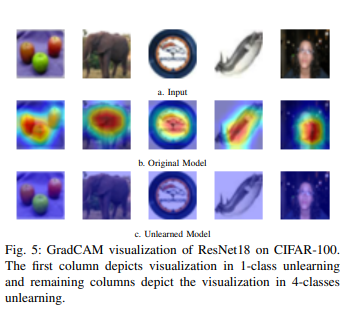
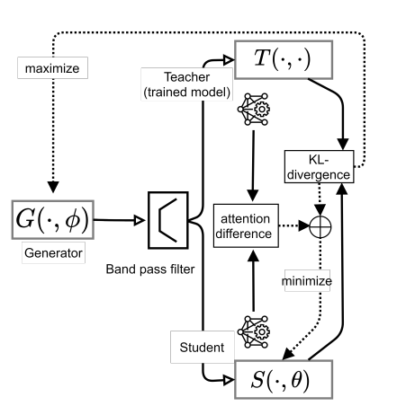

# RespAI Lab

Welcome to the RespAI Lab at KIIT Bhubaneswar, India! Our research goal is Ethical Innovation for a Transparent, Privacy-Respecting, and Safe AI Future.

## About Us

At RespAI Lab, we are dedicated to advancing the field of responsible AI. Our interdisciplinary team explores crucial aspects such as privacy, machine unlearning, data valuation, synthetic data, and generative AI. Through innovative research and collaboration, we aim to develop ethical AI technologies that prioritize user privacy and data integrity, ensuring a fair and transparent digital future.

## Recent News

- **Feb 24, 2024:** Mr. Umakanta Maharana joined as a Research Fellow (PI: Dr. Murari Mandal).
- **May 23, 2024:** 🎉 Paper Acceptance to KDD 2024! 🎉

## Recent Publications

**Fast yet effective machine unlearning**  
Ayush K Tarun, Vikram S Chundawat, Murari Mandal, and 1 more author  
IEEE Transactions on Neural Networks and Learning Systems, 2023

**Zero-Shot Machine Unlearning**  
Vikram S. Chundawat, Ayush K. Tarun, Murari Mandal, and 1 more author  
IEEE Transactions on Information Forensics and Security, 2023

## Contact Us

The best way to reach out is via email to the RespAI Lab head.

## Acknowledgments

© Copyright 2024 RespAI Lab. Powered by Jekyll with al-folio theme. Hosted by GitHub Pages. Last updated: June 08, 2024.
